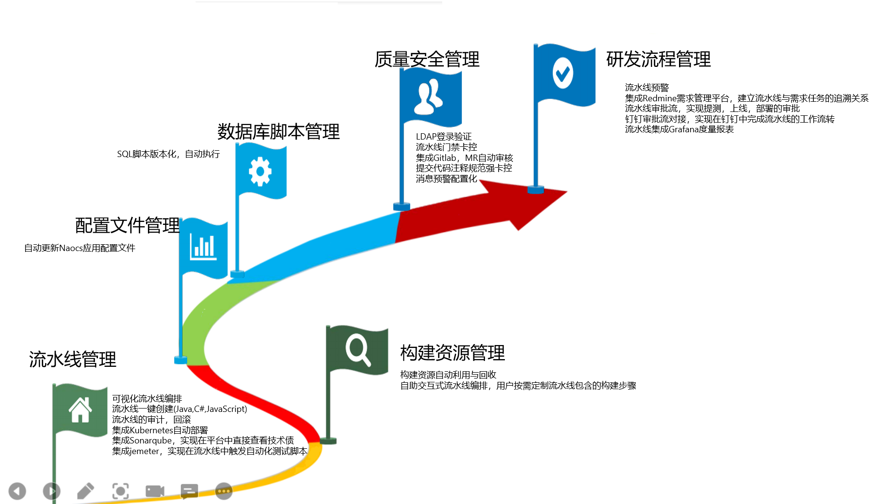

# Welcome to the EazyBuilder project!

EazyBuilder is an event-driven orchestration engine, an open source distributed DevOps platform product based on Kubernetes' independent design and development, which reduces the complexity of continuous delivery pipelines;

EazyBuilder has a flexible and easy-to-use, safe and reliable pipeline, a sound change management system, two-way traceability of the entire link, a small and intelligent approval flow, and a cloud-native IDE plug-in;

It connects various operations in cloud-native applications, provides pluggable docking, quantifies process data, provides objective and accurate performance insights, and provides enterprises with a unified DevOps collaboration plane, making it easier and more convenient to manage cloud-native The application on the infrastructure implements the DevOps culture, so as to develop and release high-quality and secure software more efficiently. EazyBuilder has built-in best practices for complex scenarios such as jenkins/Buddy, K8s YAML, Harbor, redmine/zentao/tapd, etc. It is suitable for scenarios such as sensitive and stable dual-state and high-frequency stable delivery.

Our goal is to create an extremely simple, efficient and easy-to-use cloud-native work platform through the application and integration of cloud-native technologies, standardize the development process, simplify development difficulty, improve development efficiency, enhance code quality, and support the entire software development life cycle (development , unit testing, integration testing, documentation, production release, configuration, etc.), provide a complete cloud-native development ecological environment and ecosystem, allowing enterprises to quickly embrace cloud-native, improve R&D efficiency, and then feed back the cloud-native market.

# [中文概述](./README_CN.md)

# Features and Benefits

## Features

### **Light and safe high-efficiency assembly line**

Event-driven, supports wildcards, configures different event types for different code branches, and triggers different pipelines. The operation steps are simple, no need to be familiar with the pipeline script syntax, visual arrangement, and quickly create an efficient pipeline; it does not rely on third-party tools, and uses a modular design to solve the problem of pipeline sharing and reuse. Provides fine-grained access control, single sign-on and auditing functions based on roles, records the operation content of each user, and changes the pipeline change history to meet the security requirements of users. Built-in rich early warning methods, comprehensively monitor the pipeline status, actively send abnormal logs, and continuously improve the pipeline through data-driven.

- **Flexible and easy to use**: You only need to provide the project SVN/GIT repository information, you can experience the standardization of the whole process from packaging construction, unit testing, coverage scanning, quality vulnerability scanning, component warehouse push, and automatic deployment;
- **Precise reminder**: pipeline process and scan reports, code submission and merging, real-time push via email, DingTalk, etc., and precise subscription configuration;
- **Abundant integration methods**: Support Webhook, timed automatic build, event or integrate and trigger continuous integration pipeline through OpenAPI;
- **Plug-in Enhancement**: Quality, vulnerability scanning, and other extended pipeline steps are based on automated plugin decoration and enhancement technology. There are no additional plugin installation, configuration files, or directory structure requirements for source code projects, and no additional requirements for build outputs. influences;
- **Visual orchestration**: switch-style pipeline visual orchestration method, built-in a large number of processing templates for common CI processes such as build, test, deployment, etc., support rapid customization and expansion of continuous integration pipelines;
- **Elastic Resource Scheduling**: Supports build machine load balancing, K8S elastic scheduling, supports large-scale parallel construction processing and resource scheduling requirements, and makes full use of hardware resources;
- **Mainstream development framework support**: Compatible with mainstream Java, C# and front-end development project code compilation, build and release modes; support Docker image repository, Maven repository and NPM repository push;
- **Project quality monitoring**: comprehensively grasp various engineering quality index data scanned during the operation of the assembly line, can customize quality access control, red light repair reminders, support custom statistical analysis dimensions, and provide online quality reports or emails report.

### **friendly cloud native environment**

Minute-level environment replication, providing out-of-the-box cloud native plug-ins, such as: redis, mongodb, rabbitmq, mysql. Use standard k8s yaml to manage basic middleware, which is easy to extend and easy to use.

### **Comprehensive automated testing guarantee**

Built-in quality control tools such as sonarqube, jmeter, liqiubase, etc., take security as the criterion, move security detection (code review, analysis, testing, etc.) to the early stage of the software development life cycle, so as to more efficiently develop and release high-quality, secure software.

### **Two-way traceability of the whole life cycle**

EazyBuilder has set up a wealth of buried points from requirement creation, code development, automated testing, to final online deployment, which can achieve two-way traceability in any link of the entire R&D life cycle, and integrates massive information in cloud-native development. Information silos are avoided.

### **Multi-dimensional measurement monitoring platform**

EazyBuilder adopts four horizontal and two vertical dimensions, from the dimensions of product, R&D, testing, deployment, as well as the dimensions of R&D personnel and project managers, to provide accurate, objective and comprehensive performance measurement data, to meet the different management requirements of different roles, and to accurately analyze R&D. Efficiency short board, promote steady improvement.

### **Cloud Native IDE Plugin**
Developers can obtain the core capabilities of EazyBuilder products in the IDE without switching platforms. After writing the code, you can scan the code quality, compile and package it automatically, deploy it to the self-test environment with one click, and quickly complete the self-test, joint debugging and integration verification, and the development efficiency is doubled.

# **getting Started**

- Eazybulider includes a front-end and a back-end application, the code directories are: eazybuilder-web, eazybuilder-server

#### Docker installation

- Docker version: 1.13.0+

- EazyBuilder image has been released to [Docker Hub](https://hub.docker.com/ "Docker Hub");
  You can directly use the official image of EazyBuilder
  
- Self-built mirrors

  Generate an image: docker-compose build

- start the app

  docker-compose up -d

  Use default compose file: [dockercompose/docker-compose.yml](./dockercompose/docker-compose.yml)

  

Just visit http://localhost/console/index.html

#### Kubernetes installation
Refer to the detailed tutorial to install: [k8s/README.md](./k8s/README.md)

- build machine

  The pipeline execution in EazyBuilder depends on jenkins. You need to initialize the build environment in jenkins in advance. For details, please refer to [jenkins dockerfile](./eazybuilder-server/thridparty/jenkins/src/main/docker/Dockerfile)

# **contribute**

Contributors are welcome to join the EazyBuilder project. Please see [CONTRIBUTING](./CONTRIBUTING.md) to learn how to contribute to this project.

## scope

### Scope of application

EazyBuilder is designed to solve quick and easy creation of CI pipelines. Therefore, the project will implement or has implemented:

* [Build Resource Management]
* [Visual Pipeline Orchestration]
* [Pipeline shared multiplexing]
* [Pipeline monitoring and warning]
* [event-driven pipeline]
* [Message Alert]
* [OpenAPI integration support]

### Out of range

EazyBuilder will be used with other tools in a cloud-native environment. Therefore, the following specific functions will not be included:

* [Container Resource Management]
* [Quality Protocol Integration]
* [code hosting]
* [automated test]
* [Demand Management]
* [Product Management]

# **contact us**

- "Welcome to pay attention to eazybuilder, if you encounter problems in use, you can join the group discussion"

- **Welcome to join the exchange group. You can scan the WeChat QR code below to invite you to join the group. Please specify to join easybuilder**

# **resource**

The latest documentation for each release can be found at:

- [EazyBuilder 1.0.0](./doc/referencebook/v1.0.0/referencebook_cn.md)

# **download**

- [Github Release](https://github.com/iSoftStoneGroup/EazyBuilder/releases)

# **License**

See [license](./LICENSE) for more information.

## Guidelines

We follow the [CNCF Code of Conduct](./CODE_OF_CONDUCT.md).

## route map

## Roadmap design details

### Pipeline management

#### Visual pipeline orchestration
The back-end uses the freemark template to solidify each construction into a template, and the front-end uses switch items. The user chooses the content of the construction and enters key information. After the back-end fills the data into the template, the completed jenkins pipeline script is generated and the jenkins api is called. execution pipeline

#### One-click pipeline creation (Java, C#, JavaScript)
All fixed configurations are abstracted, so that users only need to enter the address of the code warehouse to automatically create a pipeline

#### Pipeline audit, rollback
After the pipeline is modified, it is recorded in the background and stored in the history table. The pipeline differences of any two versions can be compared, and the pipeline can be specified to roll back to any version.

#### Integrated Kubernetes automatic deployment
Using kubectl+kubeconfig, the platform integrates kubectl, users can specify different kubeconfig files in each pipeline, and use kubectl --kubeconfig to manage k8s clusters in the pipeline, so as to realize cross-cluster and cross-environment management of k8s

#### Integrate Sonarqube to directly view technical debt in the platform
- Method 1: Call the sonarqube api to query the quality details of the engineering code
- Method 2: Directly query the sonarqube table to query the quality details of the project code

#### Integrate jmeter to trigger automated test scripts in the pipeline
The platform integrates the jmeter plug-in. In the build switch, the user turns on the "automated test" switch, and specifies the directory location where the automated test script is located. The pipeline directly executes the jmeter command to run the automated test.

### Build resource management

#### Build resource automatic utilization and recycling
Using the Jenkins Kubernetes Agent plug-in, when the pipeline runs, a pod is automatically created in the k8s cluster, and the pod is automatically deleted after the pipeline runs.

#### Self-service interactive pipeline orchestration, users can customize the construction steps contained in the pipeline as needed
User-defined events, such as: code commit, code merge. For each type of event, users can choose different pipelines, so that different pipelines can be developed for different projects and different environments.

### Configuration file management

When docking the nacos api, the user also puts the configuration file in the code repository. After the configuration file is changed, the corresponding pipeline is triggered, and nacos is called in the pipeline to update the configuration file in nacos

### Database script management

Docking with liqiube, using liqiube as the sql management platform

### Quality and Safety Management

#### LDAP login authentication

Integrated ldap function, you can log in with ldap user

#### Assembly line access control card control

The user configures the threshold of access control in the system, for example: BUG blocking is not greater than 5; after submitting the code, the code quality scan is performed in the pipeline, the scan results of sonarqube are collected, and the quality threshold set by the system is judged. The pipeline finally fails, aborting the subsequent process

#### Integrate Gitlab, MR automatic audit

Docking with gilab api, when the project engineering code meets the quality gate, automatically create a merge request and automatically merge into the integration branch

#### Submit code comment specification strong card control

Set up hooks in gitlab to verify the comments of the submitted code. In the comments, the legal task id must be included. If it does not meet the specification, it is forbidden to submit the code.

#### Message alert configuration

Design an alert configuration page to allow users to subscribe to message types, such as: code submission/merging, pipeline success/failure; message sending forms, such as DingTalk, email, WeChat

### R&D process management

#### Pipeline warning

Design a red light repair switch, users can turn it on in the pipeline, and configure the time interval and number of warnings. If the pipeline fails, a red light repair warning will be sent, so that developers can pay attention to some high-risk pipelines and fix development integration problems in time

#### Integrate Redmine/Zen Tao to establish the traceability relationship between pipeline and requirement tasks

- Integrate the requirements management platform, currently considering connecting Redmine and ZenTao, the developer submits the code, and the comment must contain the task id (in the requirements management platform)
- After the pipeline operation is completed, the operation result is sent to the requirements management platform (by calling the api), the content is automatically appended to the progress under the task, and the task status of the requirements management platform is automatically updated

#### Approval flow of the assembly line to realize the approval of test, launch, and deployment

For pipelines in different environments, do permission control, design approval flow, and automatically upgrade products after approval, and deploy test/production environments

#### DingTalk approval flow docking to realize the workflow of the pipeline in DingTalk

Butt DingTalk approval flow, involving the approval function, are all approved by DingTalk

#### Pipeline integration Grafana metrics report

Integrate Grafana, make Grafana reports from the process data of the platform, different roles can see different metrics reports

#### IDE plugins

Publish IDE plug-ins, developers can run plug-ins locally and deploy self-test environment with one click
